<div align="center">
  <h1 align="center">WorkSphere HRMS</h1>

  <p align="center">
    A flagship, enterprise-grade Human Resource Management System. Streamline workforce operations, project management, leaves, and payroll in one unified platform.
    <br />
    <br />
    <a href="https://work-sphere-enterprise-hrms.vercel.app/"><strong>Explore Live Demo »</strong></a>
    <br />
    <br />
    <a href="https://github.com/prathameshkamble979/WorkSphere-Enterprise-HRMS/issues">Report Bug</a>
    ·
    <a href="https://github.com/prathameshkamble979/WorkSphere-Enterprise-HRMS/issues">Request Feature</a>
  </p>
</div>

<!-- BADGES -->
<div align="center">
  
  
  
  
  
  
  
</div>

---

## 📖 Table of Contents
<details>
  <summary>Click to expand</summary>
  
  - [About The Project](#about-the-project)
  - [Key Features](#key-features)
  - [Architecture](#architecture)
  - [Database Schema](#database-schema)
  - [Tech Stack](#tech-stack)
  - [Getting Started](#getting-started)
    - [Prerequisites](#prerequisites)
    - [Installation](#installation)
    - [Environment Variables](#environment-variables)
  - [Folder Structure](#folder-structure)
  - [Future Roadmap](#future-roadmap)
  - [License](#license)
  - [Contact](#contact)
</details>

## 🚀 About The Project

**WorkSphere HRMS** is a premium, flagship Human Resource Management application designed to simplify and automate core HR processes for modern enterprises. From maintaining an accurate employee directory to orchestrating complex leave approvals, managing payroll, and integrating seamlessly with third-party tools like Slack and Google Workspace, WorkSphere covers every facet of the employee lifecycle.

Built with performance, scalability, and developer experience in mind, this project adopts the **MERN** stack powered by **TypeScript** and **Vite**, featuring a clean, responsive, and highly interactive user interface utilizing **Tailwind CSS v4** and **Framer Motion**.

### 📸 Showcase
*(To fully experience the application, visit the [Live Demo](https://work-sphere-enterprise-hrms.vercel.app/))*

<div align="center">
  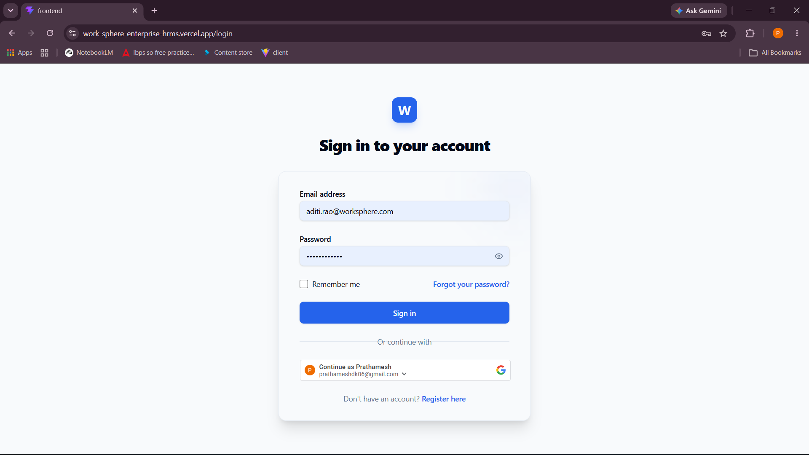
  <p><em>Secure Authentication Portal</em></p>
</div>

#### Application Gallery
| Dashboard Overview | Employee Directory |
| :---: | :---: |
| 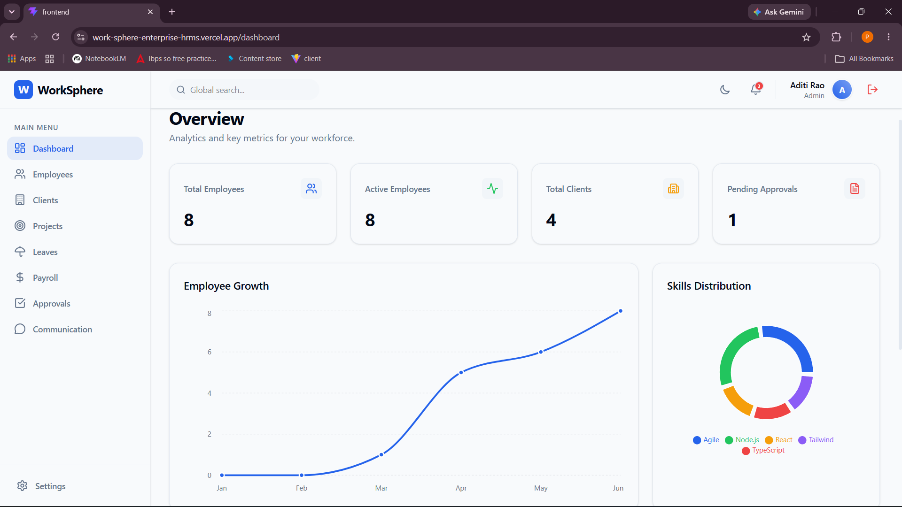 | 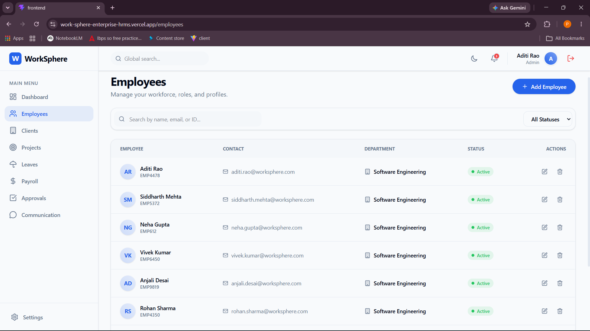 |
| **Client Management** | **Project Tracking** |
| 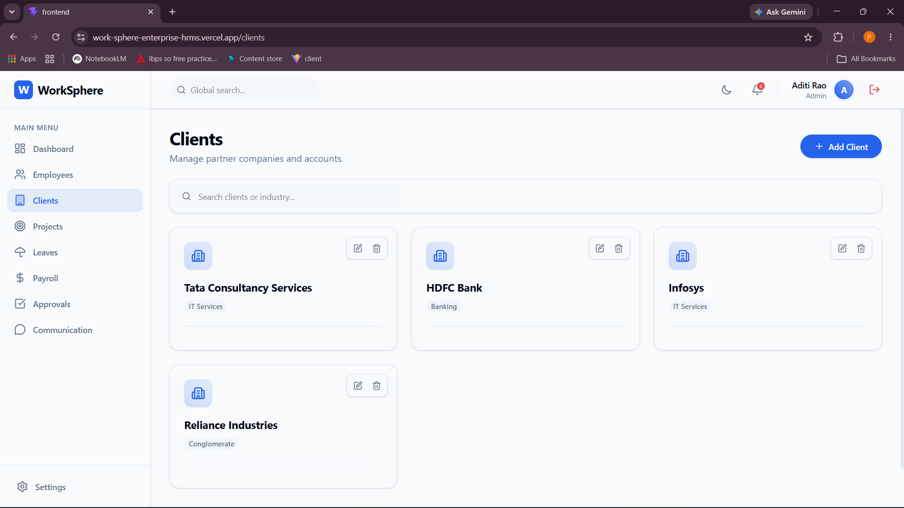 | 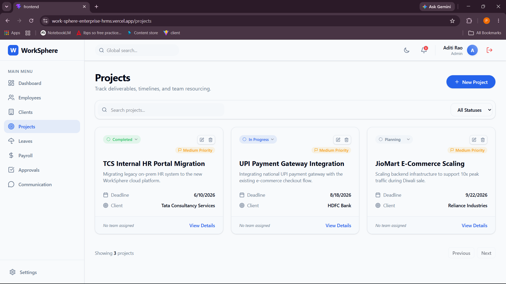 |
| **Leave Approvals** | **Communications & Announcements** |
| 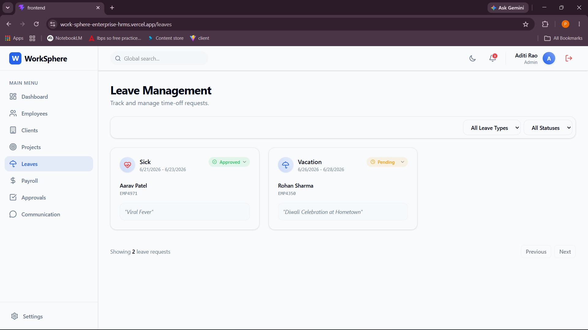 | 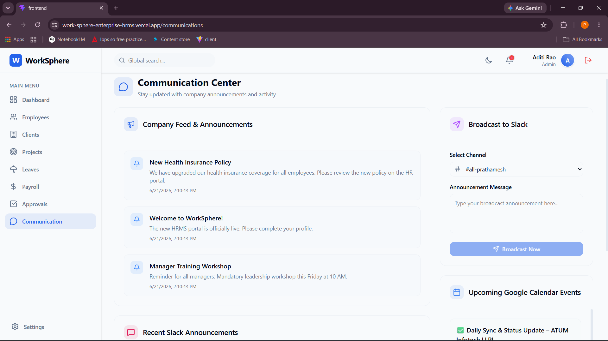 |
| **Global Settings & Integrations** | **Notification Templates** |
| 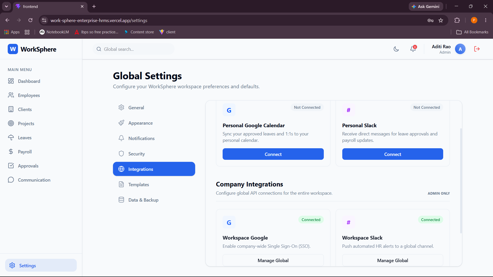 | 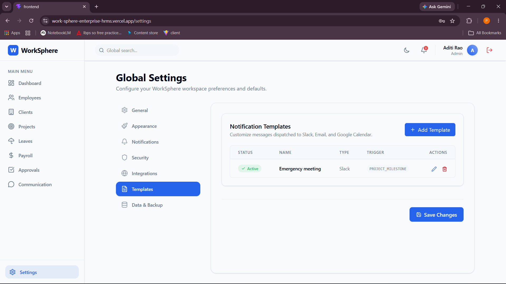 |
| **User Profile & Security** |  |
| 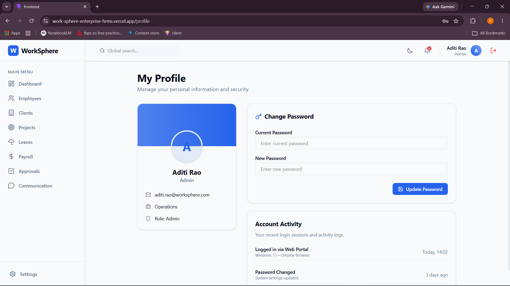 |  |

---

## ✨ Key Features

- **🛡️ Advanced Authentication & RBAC**: JWT-based secure login, persistent sessions, and robust Role-Based Access Control (Admin, Manager, Employee).
- **👥 Employee & Directory Management**: Full CRUD operations to manage staff details, roles, and historical records.
- **📈 Client & Project Tracking**: Assign teams to projects, track client deliverables, and monitor project statuses.
- **📅 Leave & Attendance**: Multi-tiered approval workflows for time-off requests, integrated with an intuitive calendar UI.
- **💰 Payroll Automation**: Securely process and track salaries, bonuses, and deductions with historical payslip records.
- **🔔 Real-Time Notifications**: Instant updates via Server-Sent Events (SSE) directly to the user's dashboard.
- **💬 Communication Integrations**: Native integration with **Slack** for announcements and **Google Workspace** for schedule syncing.
- **📊 Analytics & Reports**: Visual data representation using Recharts for actionable insights into company metrics.

---

## 🏗️ Architecture

The application follows a modular, feature-based architecture pattern, ensuring clear separation of concerns, high maintainability, and scalable codebases.

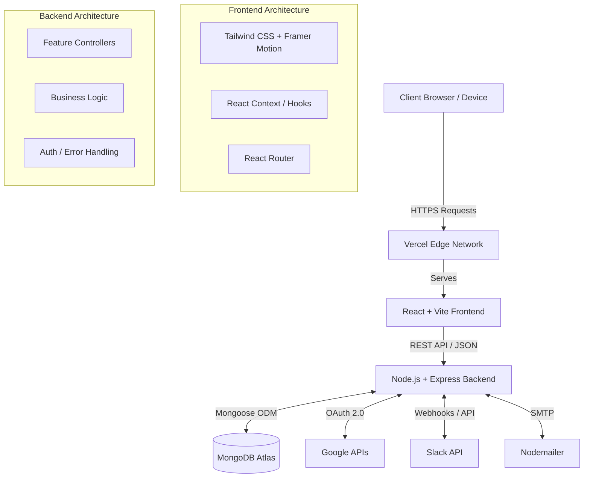

---

## 🗄️ Database Schema

WorkSphere utilizes a highly relational MongoDB design structured around core HR entities.

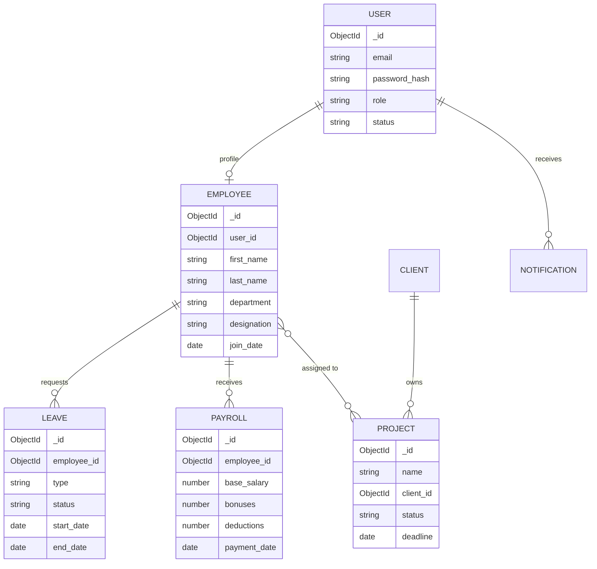

---

## 💻 Tech Stack

### Frontend
- **Framework**: [React 19](https://react.dev/) + [Vite](https://vitejs.dev/)
- **Language**: [TypeScript](https://www.typescriptlang.org/)
- **Styling**: [Tailwind CSS v4](https://tailwindcss.com/)
- **Routing**: [React Router DOM v7](https://reactrouter.com/)
- **Forms & Validation**: [React Hook Form](https://react-hook-form.com/) + [Zod](https://zod.dev/)
- **Animations & Icons**: [Framer Motion](https://www.framer.com/motion/) + [Lucide React](https://lucide.dev/)
- **Charts**: [Recharts](https://recharts.org/)

### Backend
- **Runtime**: [Node.js](https://nodejs.org/)
- **Framework**: [Express.js v5](https://expressjs.com/)
- **Database**: [MongoDB](https://www.mongodb.com/) + [Mongoose](https://mongoosejs.com/)
- **Authentication**: JWT (JSON Web Tokens) & bcrypt
- **Integrations**: `@slack/web-api`, `googleapis`, `nodemailer`
- **File Uploads**: `multer`

---

## 🛠️ Getting Started

Follow these instructions to set up the project locally on your machine.

### Prerequisites
- Node.js (v18 or higher)
- MongoDB (Local instance or MongoDB Atlas cluster)
- Git

### Installation

1. **Clone the repository**
   ```bash
   git clone https://github.com/prathameshkamble979/WorkSphere-Enterprise-HRMS.git
   cd WorkSphere-Enterprise-HRMS
   ```

2. **Install Backend Dependencies**
   ```bash
   cd backend
   npm install
   ```

3. **Install Frontend Dependencies**
   ```bash
   cd ../frontend
   npm install
   ```

### Running Locally

1. Set up your environment variables (see [Environment Variables](#environment-variables) section below).
2. **Seed the Database** (Creates initial Admin account)
   ```bash
   cd backend
   npm run seed
   ```
3. **Start the Development Servers**
   Open two terminal tabs:
   
   *Terminal 1 (Backend)*
   ```bash
   cd backend
   npm run dev
   ```
   
   *Terminal 2 (Frontend)*
   ```bash
   cd frontend
   npm run dev
   ```
4. Access the application at `http://localhost:5173`.

---

## ⚙️ Environment Variables

To run this project, you will need to add the following environment variables. Create a `.env` file in both the `backend` and `frontend` directories.

### Backend (`backend/.env`)
| Variable | Description |
| :--- | :--- |
| `PORT` | API Server Port (Default: 5000) |
| `NODE_ENV` | Environment (`development` or `production`) |
| `MONGODB_URI` | Your MongoDB connection string |
| `JWT_SECRET` | Secret key for signing JWT tokens |
| `JWT_EXPIRES_IN` | Token expiration time (e.g., `7d`) |
| `SMTP_HOST` / `SMTP_PORT` | Email SMTP Server Configuration |
| `SMTP_EMAIL` / `SMTP_PASSWORD` | Credentials for sending system emails |
| `GOOGLE_CLIENT_ID` | Client ID for Google Workspace integrations |
| `SLACK_CLIENT_ID` | Client ID for Slack API integrations |
| `SLACK_CLIENT_SECRET` | Client Secret for Slack API integrations |

### Frontend (`frontend/.env`)
| Variable | Description |
| :--- | :--- |
| `VITE_API_URL` | Base URL for the Backend API (e.g., `http://localhost:5000/api/v1`) |
| `VITE_GOOGLE_CLIENT_ID` | Public Google Client ID for OAuth login |

---

## 📂 Folder Structure

```text
WorkSphere-Enterprise-HRMS/
├── backend/
│   ├── src/
│   │   ├── config/          # Environment & logger config
│   │   ├── features/        # Feature-based modules (auth, employees, leaves, etc.)
│   │   │   ├── auth/        # Auth controllers, routes, models
│   │   │   ├── dashboard/   # Dashboard analytics aggregation
│   │   │   └── ...
│   │   ├── middlewares/     # Custom Express middlewares
│   │   ├── shared/          # Shared utilities and types
│   │   ├── app.ts           # Express App setup
│   │   └── server.ts        # Server entry point
│   └── package.json
│
├── frontend/
│   ├── src/
│   │   ├── assets/          # Static assets & images
│   │   ├── features/        # Feature-based UI components and pages
│   │   │   ├── auth/        # Login, Register pages
│   │   │   ├── employees/   # Employee list, forms
│   │   │   └── ...
│   │   ├── shared/          # Shared layout, components, contexts
│   │   ├── App.tsx          # Main React Router setup
│   │   └── main.tsx         # React DOM renderer
│   ├── tailwind.config.js   # Tailwind v4 configuration
│   └── package.json
│
└── package.json             # Root monorepo scripts
```

---

## 🔮 Future Roadmap

- [ ] **AI-Powered Insights**: Integrate OpenAI/Gemini for predictive employee turnover analysis.
- [ ] **Mobile Application**: Launch a companion React Native app for on-the-go leave requests.
- [ ] **Advanced Payroll Taxes**: Automated tax calculation module based on regional compliance.
- [ ] **Performance Reviews**: Implementing a 360-degree feedback system and OKR tracking.

---

## 🤝 Contributing

Contributions are what make the open source community such an amazing place to learn, inspire, and create. Any contributions you make are **greatly appreciated**.

1. Fork the Project
2. Create your Feature Branch (`git checkout -b feature/AmazingFeature`)
3. Commit your Changes (`git commit -m 'Add some AmazingFeature'`)
4. Push to the Branch (`git push origin feature/AmazingFeature`)
5. Open a Pull Request

---

## 📄 License

Distributed under the MIT License. See `LICENSE` for more information.

---

## 📬 Contact

**Prathamesh Kamble**  
[](https://www.linkedin.com/in/prathamesh-kamble06/)  
[](https://github.com/prathameshkamble979)  
📧 **Email**: [prathameshdk@gmail.com](mailto:prathameshdk@gmail.com)

**Project Link**: [https://github.com/prathameshkamble979/WorkSphere-Enterprise-HRMS](https://github.com/prathameshkamble979/WorkSphere-Enterprise-HRMS)
